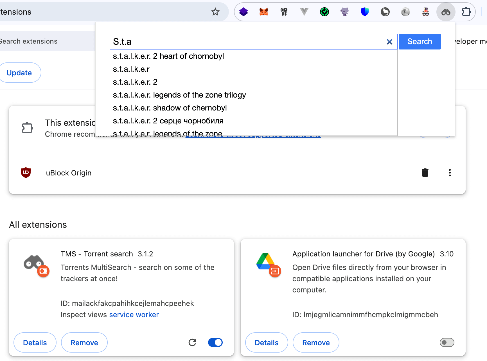
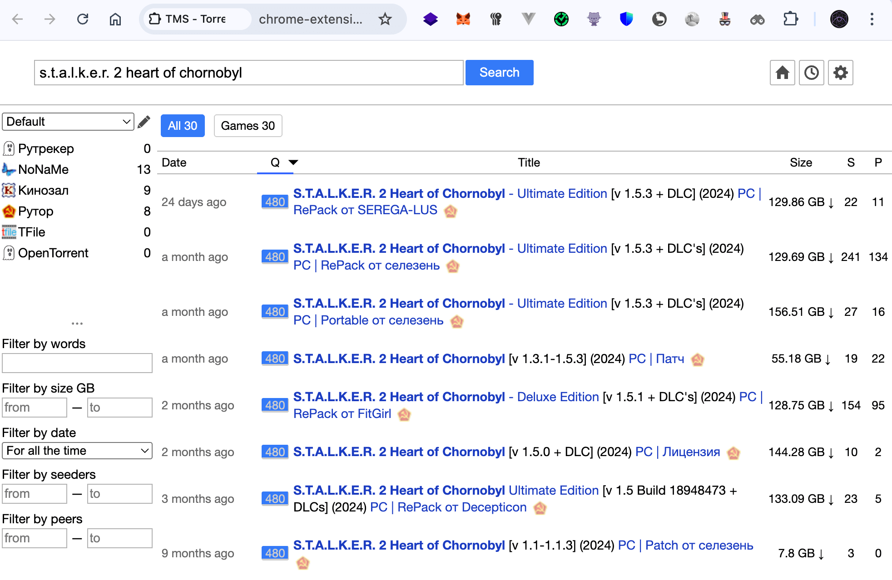

# tSearch — Torrents MultiSearch (MV3)

A browser extension that searches multiple trackers from a single UI. The project is updated and fully supports Manifest V3.

Overview
- Purpose: unified search, filtering, and viewing across multiple sources.
- MV3 support: background service worker, `chrome.action`, `chrome.scripting`, modern CSP.
- UI: popup, options page, and a sandbox to run modules.
- Fork: this project is a fork of https://github.com/Feverqwe/tSearch

Screenshots

Build
- Requires Node.js and npm.
- Commands:
  - `npm run build` — dev build (with sourcemaps, no minification).
  - `npm run release` — build trackers/json, options, Vite production build, and zip archive.
- Output: `dist/`.
- Install in Chrome: “Load unpacked” and select `dist/dist`.

Compatibility
- Chrome 88+ (Manifest V3).

Notes
- Analytics uses the Measurement Protocol from the background process (no external scripts loaded).
- Page injections use `chrome.scripting.executeScript` (MV3).

License
- See `LICENSE.md`.

___

Браузерное расширение для удобного поиска по нескольким трекерам с единого интерфейса. Проект обновлён и полностью поддерживает Manifest V3.

Основное
- Назначение: единый поиск, фильтрация и просмотр результатов по множеству источников.
- Поддержка MV3: фоновая логика на service worker, `chrome.action`, `chrome.scripting`, актуальный CSP.
- Интерфейс: popup, страница настроек и песочница для исполнения модулей.
- Форк: этот проект — форк https://github.com/Feverqwe/tSearch

Сборка
- Требуется Node.js и npm.
- Команды:
  - `npm run build` — сборка для разработки (с sourcemap, без минификации).
  - `npm run release` — сборка данных, production Vite-сборка и zip-архивация.
- Готовые файлы: `dist/`.
- Установка в Chrome: «Load unpacked» и выбрать `dist/dist`.

Совместимость
- Chrome 88+ (Manifest V3).

Примечания
- Аналитика реализована через Measurement Protocol из фонового процесса без загрузки внешних скриптов.
- Инъекции на страницах выполняются через `chrome.scripting.executeScript` (MV3).

Лицензия
- См. `LICENSE.md`.

___

## Copyright & Credits

Original project: [tSearch](https://github.com/Feverqwe/tSearch) by Anton, 2016  
Fork: [tSearch-manifestv3](https://github.com/Feverqwe/tSearch) & reslear, 2026
